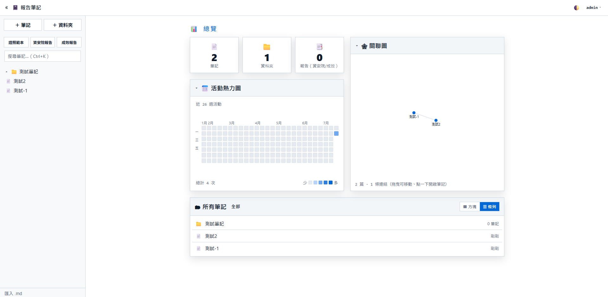
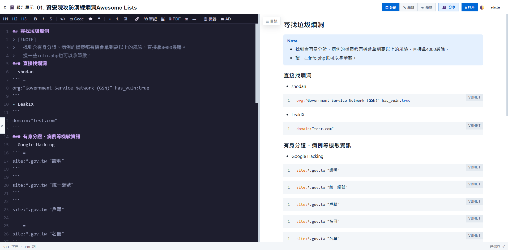
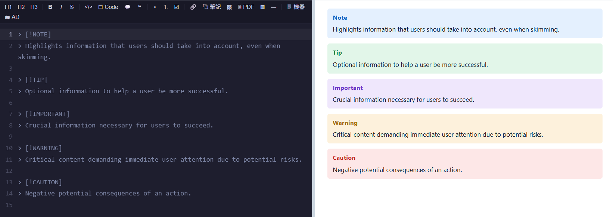
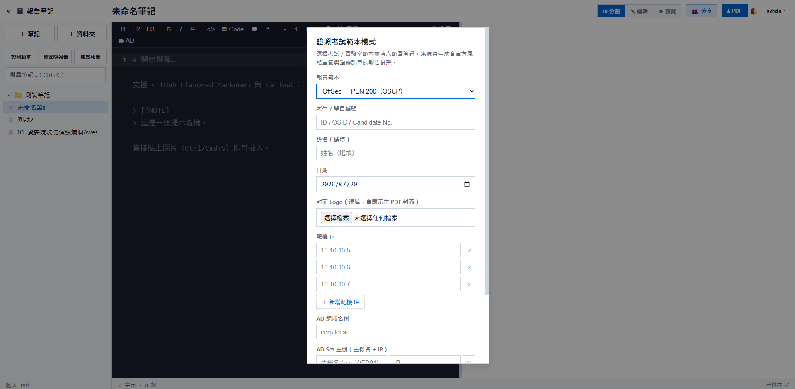

# HexNote
>[!note]
>有鑑於HackMD越來越爛，故自行用AI寫了一個HexNote，以符合自己的筆記需求，這個筆記軟體是以Markdown為基礎的筆記，同時支援生成OSCP、OSEP、LPT\CPENT跟Virtual Hacking Lab的筆記模板，並且支援生成資安院攻防演練模式的報告


裝好 Node.js 後，在資料夾中執行：
```
node server/server.js
```

然後開瀏覽器到它印出的網址（預設 http://localhost:8080）即可。
預設帳號密碼為(admin:admin)

## 系統畫面


可以使用類似Hackmd的方式編輯筆記，左邊編輯的內容可以即時顯示在右邊的預覽


## 筆記模式
主要有三種筆記模式，可以對應到不同的功能
- 一般筆記模式
- 證照範本
- 資安院報告模式
### 一般筆記模式
具備一般md的基礎語法與功能，圖片也是直接拖拉上去就可以顯示出來，其中callout採用的是github的書寫語法。
```
> [!NOTE]  
> Highlights information that users should take into account, even when skimming.

> [!TIP]
> Optional information to help a user be more successful.

> [!IMPORTANT]  
> Crucial information necessary for users to succeed.

> [!WARNING]  
> Critical content demanding immediate user attention due to potential risks.

> [!CAUTION]
> Negative potential consequences of an action.
```


### 證照範本
目前既有的模板有OSCP、OSEP、LPT\CPENT、Vurtual Hacking Lab


點擊後可以自動生成相對應的模板，讓打OSCP時只需要把相對應的東西填進去就可以，點擊右上方PDF按鈕可以下載成PDF。

